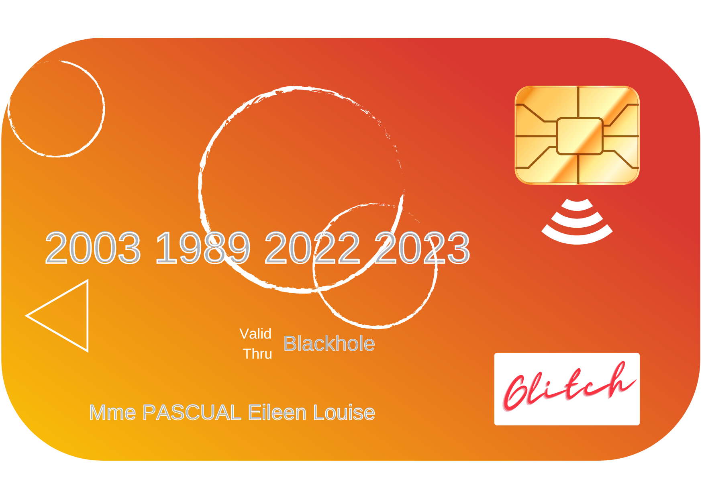
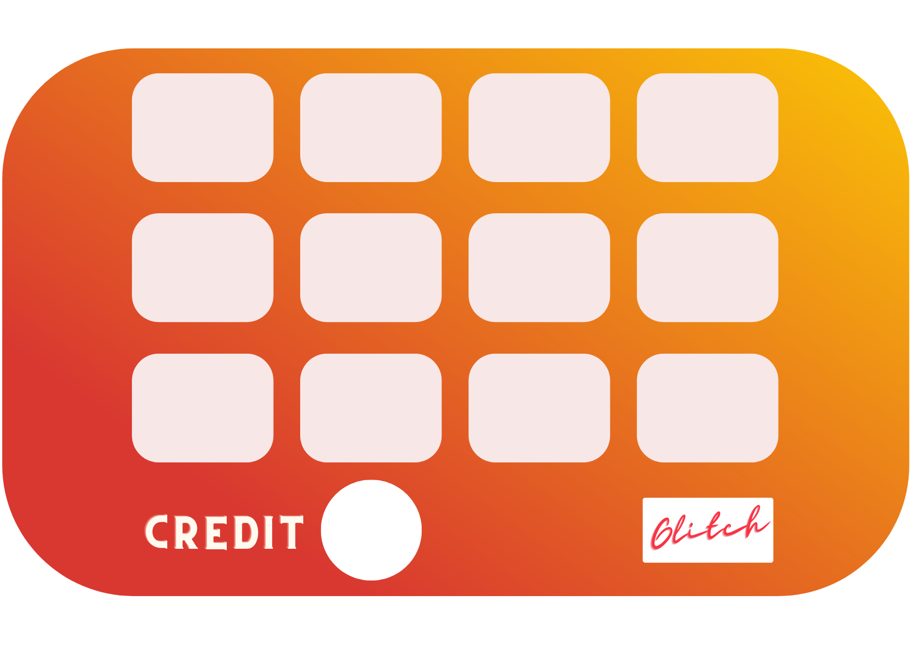
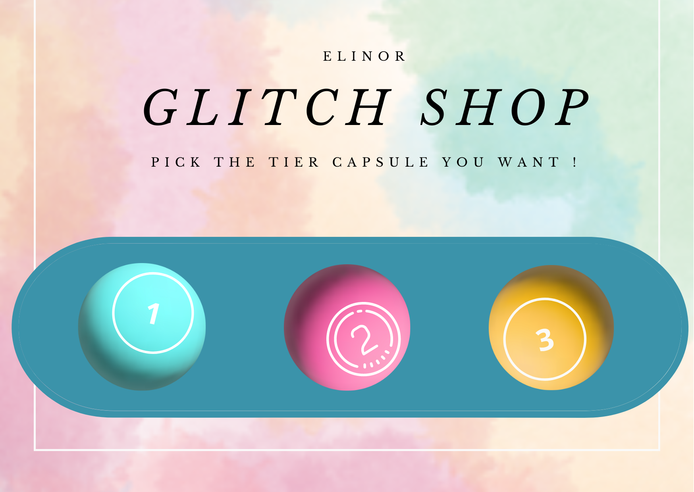

# Elinor Keeps the Score !


---

Elinor is a personal project in order to keep track of scores about wathever you want. That project has just for goal to achieve what I wanted to do so it has my own restrictions. But feel free to change them, upgrade them if you want to.

---

## Glossary

- [Elinor Keeps the Score !](#elinor-keeps-the-score-)

  - [Glossary](#glossary)
  - [Technologies](#technologies)
    - [Backend](#backend)
      - [Discord Bot -](#discord-bot-)
      - [Database / API -](#database--api-)
    - [Frontend](#frontend)
      - [Assets -](#assets-)
  - [Installation](#installation)

  ***

## Technologies

### Backend

#### Discord Bot -

- [NodeJS](https://nodejs.org/en/) _Pure and simple Node JavaScript_

- [Discord.js 14.7.1](https://discord.js.org/#/) _Discord API wrapper_

#### Database / API -

- [Json-Server](https://) _Wanted to try it since a long time_

### Frontend

#### Assets -

---

**Card :**





---

**Shop :**



---

## Installation

```sh
chmod +x startServer.sh

# Install dependencies and start the server
./startServer.sh

cd ..

# Create the .env file
nano .env

"
TOKEN = YOUR_DISCORD_BOT_TOKEN
DATABASE_PORT = 4000
DATABASE = http://localhost:4000
DEV = 0
"

# DEV Variable is used to know if you are in development mode or not and will activate some ``console.log()`` in the bot

# Install dependencies and start the bot
chmod +x controlBot.sh
./controlBot.sh
> 1

# You can manage the bot by using the micro-interface with controlBot.sh

```
